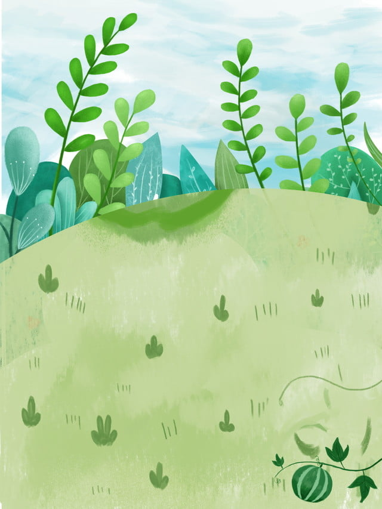

# 🐹 Whack-a-Mole Game 🎮  
> A fun and interactive browser game built with **HTML**, **CSS**, and **JavaScript** — featuring background music, smooth animations, and a game-over screen!

---

## 🚀 Project Overview  
**Whack-a-Mole 🐹** is a simple reflex-based game where players must “whack” the mole as it pops out of random holes within a 30-second timer.  
Your goal? **Hit as many moles as you can before time runs out!**

---

## 🧠 Features  

✅ **Dynamic Gameplay:** Random mole positions keep every round exciting.  
✅ **Scoreboard:** Real-time tracking of score and remaining time.  
✅ **Sound Effects:** Enjoy satisfying hit sound and looping background music.  
✅ **Game Over Screen:** Stylish overlay showing final score with “Play Again” option.  
✅ **Responsive Design:** Works smoothly on desktops and tablets.  
✅ **Smooth Animations:** Moles pop in and out with fluid motion.

---

## 🖼️ Preview  

---

## 🧩 Tech Stack  

| Technology | Purpose |
|-------------|----------|
| **HTML5** | Structure of the game |
| **CSS3** | Styling, layout, and animations |
| **JavaScript (Vanilla JS)** | Game logic and interactivity |
| **Audio** | Sound effects and background music |

---

## 🕹️ How to Play  

1. Click **Start Game 🎮**.  
2. Whack the mole 🐹 as it appears in random holes!  
3. Each successful hit increases your **score**.  
4. When the timer reaches zero, your final score will be shown.  
5. Click **Play Again** to restart!

---

## 📂 Project Structure 

📦 Whack-a-Mole
├── index.html # Main HTML file
├── style.css # Game styling and animations
├── script.js # Core game logic
├── pic.jpg # Background or design assets
├── pic2.jpg
├── pic3.avif
├── pic4.jpg
├── music.mp3 # Background music (add your own)
└── hit.mp3 # Mole hit sound

